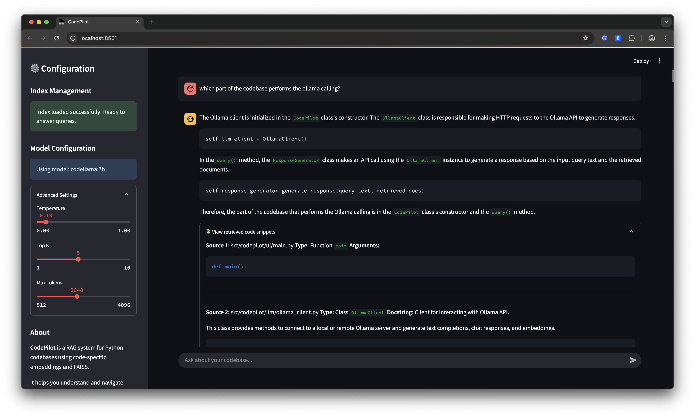

# 🧠 CodePilot

## Authors
- Anass Anhari
- Pol Vidal
- Eric Muthomi

CodePilot is a simple POC (*Proof Of Concept*) local agent for natural language understanding and querying of Python codebases. It uses a RAG (*Retrieval Augmented Generation*) architecture that parses, embeds, and retrieves code snippets to help developers explore and understand Python projects efficiently, and most importantly, with no internet connection 😁! 

The system is designed to be modular and extensible, allowing for easy integration of different models and components, hence, it can be adapted to various use cases and programming languages (AST Parsing, ...). The architecture consists of several core modules, including a code processor, vector database, engine, and user interface.

## Examples

Here are some examples of CodePilot in action:




## Project Structure

CodePilot is organized into several modules:

- **Processors**: Parse and process Python code files
  - `ast_parser.py`: Uses Python's Abstract Syntax Tree to extract code structure
  - `chunker.py`: Splits code into manageable chunks for embedding
  - `metadata_extractor.py`: Extracts additional metadata from code

- **Vector DB**: Manages the vector database for code retrieval
  - `embeddings.py`: Generates embeddings using the CodeBERT model
  - `faiss_store.py`: Stores embeddings in a FAISS index for efficient similarity search

- **LLM**: Handles interactions with language models
  - `ollama_client.py`: Client for interacting with Ollama API
  - `prompt_templates.py`: Templates for structuring prompts to the LLM

- **Engine**: Core retrieval and response generation
  - `retriever.py`: Finds relevant code snippets
  - `response_generator.py`: Generates natural language responses

- **UI**: User interfaces
  - `main.py`: Streamlit web interface
  - `launcher.py`: Script to launch the Streamlit UI


## Installation

### Prerequisites

- Python 3.8 or higher (>=3.11 recommended)
- [Ollama](https://ollama.ai/) installed and running locally with the CodeLlama model 

### Step 1: Clone the repository

```bash
git clone https://github.com/Anass-23/CodePilot.git
cd CodePilot
```

### Step 2: Install the package

> Recomended to use a virtual environment
```bash
python3.11 -m venv env
source env/bin/ctivate
pip install -U pip
```

This will install CodePilot and all its dependencies

```bash
pip install -e .
```

## How to Run the Agent

CodePilot offers two interfaces: a command-line interface and a web-based UI.

### Command-Line Interface

1. **Index a codebase** - Before querying, you need to index a Python codebase:

```bash
codepilot --index /path/to/your/python/project
```

2. **Query the codebase** - Once indexed, you can query the codebase:

```bash
codepilot --query "How does the retriever module work?"
```

3. **Interactive mode** - Run without arguments to enter interactive mode:

```bash
codepilot
```

### Web-Based UI (Streamlit)

Start the web interface with:

```bash
codepilot-ui
```

> Note: Before quering, you also need to index the codebase

This launches a Streamlit app where you can:
- Ask questions via a chat interface
- Configure model parameters

## 💬 Usage

### Example Queries

Here are some examples of questions you can ask:

- "What does the `generate_response` method in the `ResponseGenerator` class do?"
- "Show me how chunks are processed in the codebase"
- "Explain the vector store implementation"
- "How does the system handle errors?"

### Configuration

CodePilot's behavior can be customized by modifying the `config.py` file:

- **EMBEDDING_MODEL**: The model used for creating embeddings (default: `microsoft/codebert-base`)
- **MODEL_NAME**: The LLM model to use via Ollama (default: `codellama:7b`)
- **TEMPERATURE**: Controls randomness in responses (default: `0.1`)
- **TOP_K**: Number of code snippets to retrieve (default: `5`)

## How It Works

1. **Indexing**: CodePilot parses Python files using the AST module, chunks the code, generates embeddings using CodeBERT, and stores them in a FAISS index.

2. **Querying**: When you ask a question, CodePilot:
   - Embeds your query
   - Finds similar code snippets in the vector database
   - Sends the relevant context along with your question to a language model
   - Returns the generated response

3. **Local Processing**: All processing happens on your machine - no code is sent to external servers 😁


## License

This project is licensed under the MIT License - see the LICENSE file for details.
